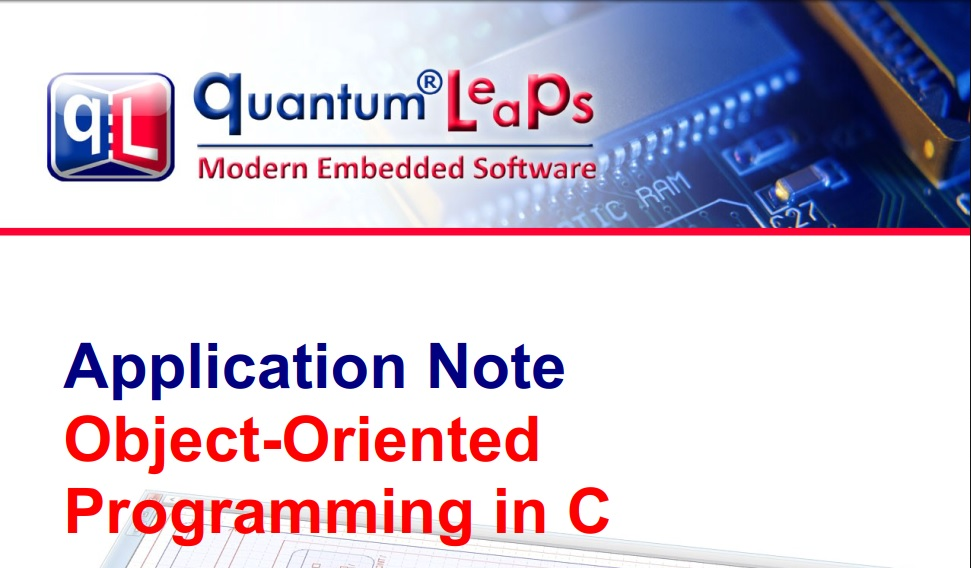

# 面向对象编程在C语言中的应用

> **艾恩凝**
>
> [https://aeneag.xyz](https://aeneag.xyz)
>
> **#公众号：技术乱舞**
>
> **声明：本文章翻译于外网文档，翻译内容未经授权禁止复制转载**
>
> 文章于2021/12/29翻译

该项目原文档github链接 [https://github.com/QuantumLeaps/OOP-in-C](https://github.com/QuantumLeaps/OOP-in-C)

本项目已进行翻译，可在项目中进行下载

**中文翻译链接** [https://pic.aeneag.xyz/OOP_in_C_Aen.pdf](https://pic.aeneag.xyz/OOP_in_C_Aen.pdf)

**原文档链接：**[https://pic.aeneag.xyz/OOP_in_C_Aen.pdf](https://pic.aeneag.xyz/OOP_in_C_Aen.pdf)

